# OJC-shell

## ojcsh... in A.U.R BTW
**OJC-shell** is a lightweight, minimal, and extensible Unix-like shell written in pure C - designed as the first building block of the **OJclicks OS** vision... (still far but working.)
---
This project is **yeap...** another shell bash-like and yeap it's still based on linux... 
---
And another **yeap...** it's a learning shell project... to know how ur shell runnig (bash, zsh, fish, etc...).
---

## Philosophy

OJC-shell is built on three core principles:

### 1. Simplicity over abstraction

No unnecessary layers. Every line of code serves a purpose.

### 2. Learning by building

This shell exists as a hands-on exploration of how the procces runnig or actually(how the shell can take from u a command and run it.)

### 3. Open source as a movement

Knowledge should not be hidden behind binaries or paywalls... (as u see the code... i don't understand my code.)

---

## Features

* Basic command parsing and execution
* Process handling using low-level system calls
* Minimal dependencies (pure C, close to the metal)
* Designed to evolve alongside **OJclicks OS** (again... still far).

---

## HOWTO (manually)...
if you wanna to make a changes you just need to copy code to your trem 

``` bash 
$ git clone https://github.com/gragero/OJC-shell.git
```

and confirm your adding or editing to the source code... (better not).

whenever you end just make this comand
in src/ directory BTW

``` bash
$ make
```

and congratulations... you are a programmer now
open it with

``` bash
$ ./ojc
```

if u wanna make it global... do this.

``` bash 
$ sudo cp path/to/ojc /usr/bin/
```

then run it with...

``` bash
$ ojc
```

just it...
---

## Why this matters

Most developers use shells.
Few understand how they actually work.

**OJC-shell** is an attempt to close that gap.

It is not production-ready — and that’s intentional.(cuz bash better than it)... i'm the developer and i say it.
It is raw, evolving, and transparent.

---
## known issues
* still working in sleep proccess.
* still working in clean code.
* still working in the shell at all.


---

## OJclicks OS Vision

OJC-shell is the entry point to a larger ambition: building a full operating system from scratch.

Not as a copy.
Not as a tutorial clone.
But as a personal, experimental, and open system. (egyptian BTW).
And not f*cking ai use or based or even inspired.

---

## Contributing

Contributions are welcome — but more importantly, curiosity is required.

If u:

* Want to understand systems on a deeper level
* Enjoy working close to the hardware
* Believe open source is about sharing knowledge, not just code

Then u're in the right place.
Or u can go to ur projects... to make ur money.

---

## Final Note

This project is a journey, not a finished product.

If it breaks, fix it.
If it’s unclear, improve it.
If you learn something, share it cuz i wanna learn it...

thank u cuz u just wasted some minutes from ur time.

## Author
**AboHgegA**
2026
## BTW i am (Egyptian) so sorry if my english not good (cuz it is at all).


